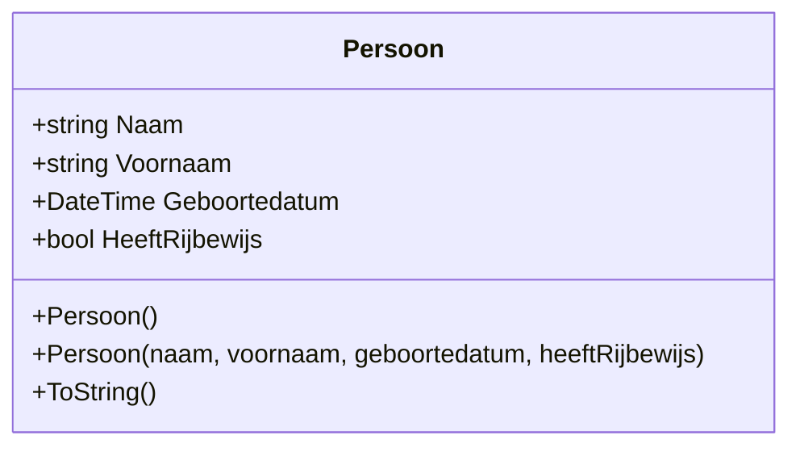

# Klassendiagram

```mermaid
classDiagram
    class Persoon {
    +string Naam
    +string Voornaam
    +DateTime Geboortedatum
    +bool HeeftRijbewijs
    +Persoon()
    +Persoon(naam, voornaam, geboortedatum, heeftRijbewijs)
    +ToString()
    }
```
